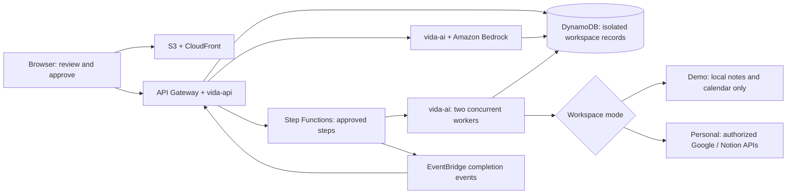

# Vida — judge evidence

Entry: https://dahb851px2bik.cloudfront.net/test

## Screenshot sequence

1. **01-workspace.png** — A freshly created, populated sample workspace. Fictional content and isolation banner visible.
2. **02-approval-preview.png** — Five proposed changes before approval. Details are expandable; no new requested changes have run.
3. **03-completed-results.png** — Completed results in the same demo workspace, with destination links and explicit no-sync wording.

Files are in `judge-evidence/`. These show local demo destinations, not actual Google Calendar or Notion writes. Earlier real-integration screenshots remain in the local development archive, excluded from the public source tree. They are historical evidence and have not been reverified in this final pass.

## What we verified

- **Approval gate:** The live five-action test returned five pending proposals; task count remained three until approval.
- **Isolation:** Regression tests create two separate visitor sessions and verify different user IDs/tokens with owner-scoped data. Earlier live session checks also confirmed separate visitors.
- **No sample sync:** Test-mode OAuth and sync are blocked; mocked provider executors are not invoked by local sample actions. The live test workspace had no integration records.
- **Local integrity:** Tests cover repeated approvals, stale Notion previews, and calendar conflicts before completion.
- **Builds:** 80 backend regression tests passed before this final UI-only polish. The production frontend build passed after the polish.

## Architecture

## Not established

No measured human-user benefit study, guaranteed success for arbitrary prompts, flawless recovery from all external failures, permanent account authentication, or guaranteed judge score. New replanning features are deferred.

## Final live checks

- All five proposals completed through the deployed workflow after approval.
- Saved note text and the calendar event were read back through the API.
- Repeating approval for every completed proposal left task, document, and calendar records unchanged.
- Browser refresh restored the five-completed summary and saved tasks.
- `judge-evidence/aws-connection-and-workflow.json` contains authenticated AWS account evidence and a SUCCEEDED execution. It deliberately excludes credentials, tokens, and execution inputs.
- A final shopping-list lookup exposed write misclassification; an explicit read-only path and regression test were added. The backend suite now has 81 passing tests. The final answer prompt consolidates identical shopping lists instead of treating different note titles as a conflict.
- The repaired shopping-list lookup returned the saved grocery items with three source references, without another action proposal. The earlier erroneous proposal was never approved.

The raw AWS connection file demonstrates authenticated CLI access and execution status. It is not a substitute for any specifically required AWS Console connection screenshot.
- Clean final browser rerun: starter → five pending approvals → five completed changes → refresh → “What's on my shopping list?” returned “Eggs, milk, rice, spinach, and bananas [S1][S2].” No extra action proposal or error appeared. `04-saved-context.png` records this answer.
