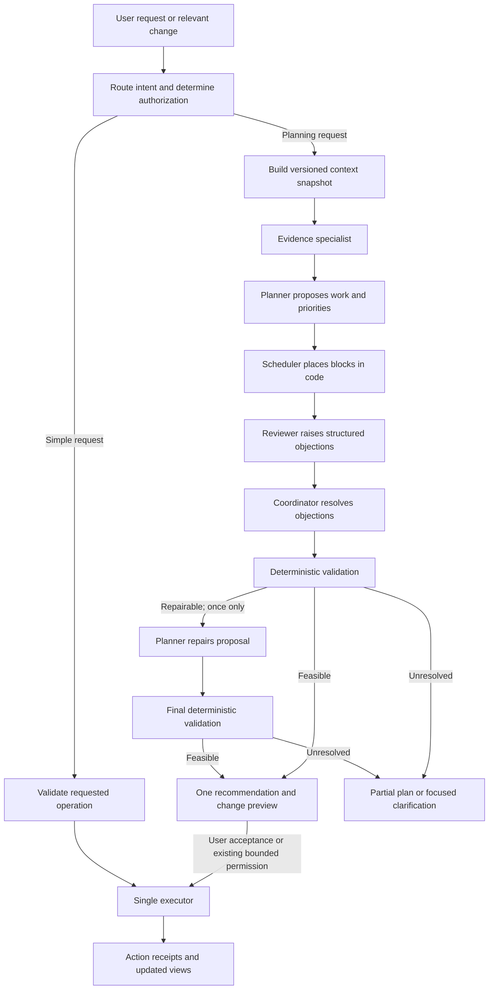

# Vida: product, planner, and agent architecture review

> **Scope note (finalized MVP):** [PLAN.md](PLAN.md) and [DESIGN.md](DESIGN.md) define the current implementation. This document retains review rationale and future-product ideas. Notion synchronization, scheduled reports and long-term trend views are deferred; DynamoDB is the hackathon source of truth.

Review date: September 30, 2026. Reviewed `PLAN.md`, `DESIGN.md`, and the supplied idea/hackathon notes. This is a proposed direction, not an implemented system or a set of approved product requirements. The project directory currently contains planning documents, not application code; findings below refer to those specifications.

Follow-up: [Notes, synchronization, and long-term reports](NOTES_AND_REPORTS.md) incorporates the supplied AWS Free plan email, daily-to-yearly reporting requirements, and a Notion/Google Keep comparison. It proposes Notion as the editable source of truth for notes-based tracking, refining the AWS-only storage direction below.

**Recommendation: make Vida a personal planning assistant that turns a person's commitments, priorities, and available capacity into a realistic plan—and adjusts that plan when life changes.**

Suggested pitch: “Vida connects what matters to you with the time you actually have. It creates a realistic plan, explains the trade-offs, and helps you adjust when your day changes.”

The strongest demonstration is a complete loop: capture context → plan → act → reflect → replan. RAG supplies evidence, specialist agents contribute advice, and ordinary application code enforces scheduling and action rules.

## 1. What to keep, change, and defer

| Current idea | Assessment | Recommended change |
|---|---|---|
| Import personal context once | Useful, with a strong first-use experience | Accept a short brain dump, a document, or sample data. Present extracted facts separately from suggestions. |
| Automatically generate 5–8 goals, 15–25 tasks, and multiple habits | Likely to overwhelm people and invent commitments | Start with 1–3 confirmed priorities and a small first-day plan. Keep other suggestions uncommitted. |
| Profile-aware planning | Central to the product | Model availability, responsibilities, preferences, and constraints; a resume alone is insufficient. |
| Planner, Coach, Analyst | Useful roles, but responsibilities overlap | Separate evidence, proposal, critique, validation, and execution. Only one service writes accepted changes. |
| Calendar as a stretch feature | Inconsistent with a realistic planner | Make availability and fixed commitments core. A simple agenda and manual busy blocks are enough initially. |
| Dashboard, Tasks, Goals, Habits, Journal, Chat as separate main pages | Creates navigation overhead and repeated information | Use four destinations and shared underlying records; see section 7. |
| Skill ratings inferred from a resume | Evidence of exposure is not evidence of proficiency | Mark imported skills “mentioned”; use self-assessments or actual assessments for proficiency. |
| Streaks and completion percentages | Can be motivating, but easily become misleading | Prefer delivered outcomes, plan realism, and supported progress. Make streaks optional. |
| “Works for anyone” | Reasonable architectural goal; unproven product claim | Support flexible profiles, then validate with a small initial community and diverse example scenarios. |
| “Remembers everything” | Overpromises coverage, freshness, and retention | Let people inspect, correct, exclude, and delete what Vida uses. |
| More AWS services and more agents as differentiation | Adds work without establishing user value | Demonstrate one measurable improvement in planning and one reliable recovery from a changed day. |

The current plan's competitive claims are not supported by an accompanying comparative evaluation. Treat them as hypotheses. Service count, a dark theme, and agent count do not establish implementation quality.

## 2. One product model, with no duplicate work items

Keep concepts distinct, but connect them by IDs. A to-do is a task; “today's task” is a view of that task; a calendar block reserves time for it; a follow-up is a task linked to a communication.

| Concept | Meaning and ownership |
|---|---|
| Profile | User-confirmed priorities, timezone, availability, constraints, preferences, and permissions. |
| Goal | An outcome with a success measure and optional target date. “Finish a portfolio” is different from “work for 30 minutes.” |
| Project | A bounded body of work that can support goals. A task can also stand alone. |
| Task | The single canonical actionable item, with its status, remaining effort, dependencies, and source. |
| Routine | A recurring template that produces task occurrences. Each occurrence has one completion state. |
| Calendar event | An appointment or external commitment; source ownership and edit permissions are explicit. |
| Time block | A reserved interval linked to an existing task, with a lock flag. One task can require multiple blocks. |
| Journal entry | Original reflection, separately stored from suggested insights or extracted actions. |
| Check-in | Optional, dated energy/mood/capacity signals; temporary context rather than permanent identity. |
| Skill evidence | Self-assessment, assessment result, or an artifact linked to a skill and a date. |
| Source | Document or communication, with owner, version, timestamp, permissions, and location. |
| Plan revision | A versioned set of proposed or accepted blocks, referenced tasks, changes, and deferrals. |
| Action receipt | What an operation actually changed, with status and external IDs when applicable. |
| Report | A derived view of activity and outcomes for a specified period, never another task store. |

Relationships: `Goal ← Project ← Task ← TimeBlock`; `Routine → Task occurrence`; `Source → suggested Task`; `Task completion → Activity → Report`; `Journal → optional planning signal`. Relationships are optional where appropriate; do not force groceries into a career goal.

**Minimum task fields for planning:** `id`, `owner_id`, `title`, `status`, optional `project_id`/`goal_id`, `remaining_minutes`, `estimate_source`, optional `due_date` or `deadline_at`, `earliest_start`, `dependency_ids`, `splittable`, `minimum_block_minutes`, `energy_requirement`, `source_ref`, and `version`. Advanced fields can stay behind defaults rather than appearing in the creation form.

Separate a date-only due date from an exact deadline. Store instants consistently, preserve the person's IANA timezone, and apply their local date when resolving “today” or “Friday.” Preserve recurrence timezone and daylight-saving behavior rather than using a fixed UTC offset.

**Rules that prevent duplication:**

- Planning schedules existing task IDs; it does not recreate tasks each morning.
- A routine occurrence is unique by routine ID and scheduled occurrence, not merely its title. Completing it updates every view.
- Imports preserve source identifiers and versions. Reimporting a document does not regenerate accepted commitments.
- External events are keyed by connection, calendar, event, and occurrence identifiers. Store mappings for exported blocks to avoid importing them again as unrelated events.
- Similar titles can prompt a merge suggestion, but semantic similarity alone must not merge legitimate separate tasks.
- Every mutation has an idempotency key. Retrying “accept plan” returns the existing result.
- Reports and chat link back to canonical records. They never maintain independent completion states.

## 3. Profile, onboarding, and personalization

Replace the required Student / Working / Both selector with optional responsibilities and priorities. People may be caregivers, freelancers, retirees, shift workers, students, or several at once. Labels can suggest defaults but should not determine goals.

The minimum setup is: “What matters this week?”, “When are you usually available?”, and timezone confirmation. Offer sample data and a skip path. Then let users add a brain dump, upload a document, or enter fixed commitments. A master document must not be a prerequisite.

An import produces three groups:

| Group | Example | Behavior |
|---|---|---|
| Supported fact | “You listed Python on your resume.” | Show the source; allow correction. |
| Uncertain interpretation | “This may be a job-search goal.” | Ask only if it affects the immediate plan; otherwise leave unconfirmed. |
| Suggested action | “Practice one interview question.” | Keep as a suggestion until accepted or directly requested. |

Do not infer hard deadlines, skill scores, health habits, family responsibilities, or available hours from a resume. Unknown is a valid value. If there is no calendar information, label the result a priority list until availability is supplied.

Useful profile layers:

- **Stable context:** timezone, language, responsibilities, chosen goals, accessibility preferences.
- **Planning preferences:** working windows, breaks, maximum focus block, travel buffers, protected personal time, acceptable reminder frequency.
- **Current state:** active tasks, appointments, recent progress, blockers, today's optional check-in.
- **Learned preferences:** tentative observations such as typical task duration, with evidence and a way to reject them.
- **Permissions:** allowed sources, journal use, integrations, and which automatic actions are allowed.

Store provenance and freshness for facts: `source_ref`, `observed_at`, `confirmed_at`, `status`, and optional `expires_at`. A newer explicit correction overrides an older imported statement. A calendar's current event state governs its busy interval. Resolve conflicts by fact type rather than allowing an LLM to pick whichever passage sounds convincing.

The request mentions “mode”; support both meanings distinctly. **Planning mode** is a user choice such as Balanced, Focus, or Light. **Mood/energy** is an optional check-in. Modes can change workload targets and block lengths; they cannot silently move appointments, waive deadlines, or rewrite the person's long-term priorities. A low-energy entry expires rather than becoming a permanent label.

## 4. How the planner should work

Use three horizons: goals and milestones for the longer term, a weekly capacity allocation, and an executable daily agenda. For the hackathon, implement the daily agenda first, with a short look-ahead for approaching deadlines.

### Inputs and constraints

Read current tasks, dependencies, calendar events, user availability, locked blocks, goals, and optional check-in signals from structured data. Retrieve documents only for context that is actually needed—for example, the requirements for an assignment.

**Hard constraints:** fixed events, unavailable time, user-locked blocks, dependencies, earliest starts, explicitly hard deadlines, and any user-defined nonnegotiable limit. **Soft preferences:** preferred study times, energy fit, shorter blocks, goal balance, context switching, and how much slack to retain. A user can promote a preference to a hard constraint.

Calculate usable intervals by subtracting the union of busy and protected intervals from allowed planning windows. Include travel, breaks, and uncertainty buffers without counting the same interval twice. A tentative default is to retain roughly 20% of otherwise usable time as slack; expose this as an adjustable product default, not a scientific rule.

### Planning sequence

1. **Snapshot:** record current entity versions and calendar freshness. Check that required inputs exist.
2. **Normalize:** interpret dates, distinguish deadlines from preferences, identify missing duration estimates, and validate dependency references/cycles.
3. **Identify candidates:** retain existing work; propose new subtasks only where useful. Use tentative estimates when the user has none, and label them.
4. **Check feasibility:** compare remaining work and dependencies with available intervals before deadlines. Flag impossible commitments early.
5. **Prioritize:** protect explicit commitments, rank deadline risk and prerequisites, then incorporate chosen goals, energy fit, and neglected priorities. Avoid a universal opaque “life score.”
6. **Schedule in code:** place eligible work in actual intervals. A simple reproducible heuristic is adequate initially; advanced optimization can follow measured failures.
7. **Critique and repair:** let a reviewer challenge assumptions and overload. Run calendar/dependency validation again after any repair.
8. **Explain the result:** show scheduled work, what stayed unchanged, what was deferred, why, and assumptions affecting feasibility.
9. **Commit when authorized:** recheck versions, apply the selected changes through one executor, and return actual action receipts.

The language model helps decompose tasks and interpret intent. Interval arithmetic, overlap detection, dependency validation, allowed actions, and state transitions belong in application code.

### Handling an impossible day

Suppose the user has 90 usable minutes, a 60-minute assignment due tonight, a 15-minute promised follow-up, and a 45-minute optional practice session. A feasible recommendation is the assignment plus follow-up, retaining 15 minutes and moving practice to another available day. If the practice also has a hard deadline tonight, explicitly report that all commitments cannot fit and identify the smallest user decision needed. Never claim that agent agreement made the schedule feasible.

### Replanning

Trigger a draft replan when the user asks, a commitment changes, a task takes longer, a blocker clears, or the user changes today's capacity. Coalesce nearby events to avoid repeated replans and notifications.

Preserve completed, started, and locked work. Prefer moving the fewest future blocks. Present a change summary such as “Move reading to tomorrow; keep the assignment and appointment.” Never convert a missed task into both an overdue task and a new copied task.

Before commit, compare the plan's input versions with current state. A conflicting edit invalidates the affected proposal; refresh and present the revised changes. Mark unsynced calendars and tentative plans visibly. Without live provider data, promise conflict checks only against imported or manually entered commitments.

## 5. Multi-agent pipeline: bounded review, one final recommendation

The current Planner → Coach → Synthesis sequence can improve wording without proving a plan is possible. Replace free-form debate with structured proposals and objections. Agreement is not a correctness test, especially when all roles use the same model.



| Component | Responsibility | Write authority |
|---|---|---|
| Router / coordinator | Select the workflow, enforce budget, resolve objections, assemble the recommendation | No domain writes |
| Evidence specialist | Retrieve relevant sources and summarize known facts, uncertainties, and freshness | Read-only |
| Planner | Propose priorities, necessary subtasks, estimates, and candidate changes | Proposal only |
| Reviewer | Challenge overload, unsupported assumptions, neglected commitments, and disruption | Objections only |
| Scheduler / validator | Calculate slots and enforce constraints, schemas, permissions, and versions | No domain writes |
| Executor | Apply authorized changes once and report the actual result | Restricted domain writes |

A role does not require a separate service, model vendor, or persistent agent. In the MVP, the evidence role can largely be retrieval code, followed by a planner call and a reviewer call. Use a coordinator in code. Add dedicated skill or communication specialists only when a request requires them. Calendar calculations never need a conversational calendar agent.

Useful specialist contracts:

```text
EvidenceBundle = facts + source_refs + entity_versions + freshness + unknowns
PlanProposal   = existing_task_refs + proposed_tasks + priorities + assumptions
ReviewIssue    = constraint_id + severity + affected_ids + evidence + suggested_change
FinalDecision  = plan_revision + accepted_changes + deferred_items + explanations
ActionReceipt  = operation_id + status + changed_ids + provider_receipt + error
```

Every stage reads the same snapshot. The reviewer gets the proposed plan and independent constraint checks, not merely a request to agree with the planner. If independent specialists run concurrently in a later version, their outputs must still reference that snapshot.

**Decision policy:** permission and hard-constraint failures veto execution; explicit user commitments outrank inferred preferences; among feasible alternatives choose the one that advances confirmed priorities with the least disruption. Low-evidence advice is labeled as optional. Irreconcilable user preferences produce one focused question or a feasible partial recommendation, not an invented consensus.

Bound the workflow: one initial plan, one review, at most one repair, then stop. Set total time, token, retrieval, and tool-call budgets across retries, not independently per agent. A reviewer timeout leaves a visibly unreviewed draft; failed calendar freshness checks prevent a claim of confirmed availability. A repeated invalid output produces a useful failure state rather than another agent loop.

Show users short explanations such as “Kept your fixed meeting; prioritized tomorrow's deadline; moved optional practice.” An expandable “Why this plan?” can show evidence, assumptions, and resolved objections. Do not expose raw internal reasoning or make users watch multiple agents talk.

## 6. Actions, knowledge, communication, and reporting

### Action semantics

“Add a task to call Alex tomorrow” can immediately perform the requested internal mutation after validation, with Undo. “What should I do tomorrow?” should return a proposal. “Plan my week” should not silently create a large permanent backlog or move external meetings.

Offer three understandable settings: suggest changes; apply specified internal planning changes automatically; and enable selected external actions. Permissions must be scoped to operation and resource. Calendar invitations and outbound messages need explicit authorization for the concrete action or a suitably bounded standing rule.

Keep proposal generation separate from execution. Never say “created,” “sent,” or “scheduled” until the corresponding operation succeeds. For partial failure, report exactly which actions succeeded. External retries should use stable operation IDs and reconcile provider state; do not assume rollback can unsend a message or erase an invitation already delivered.

### Knowledge and memory

Use structured queries for current status, time blocks, counts, and deadlines. Use retrieval for document content, project notes, and permitted communication context. Loading every document into every prompt is full-context prompting; it does not implement query-based retrieval.

Retrieve only authorized, relevant, current source versions. Include source references in factual answers. If evidence is missing or contradictory, preserve that uncertainty. Imported text is data, never authority to call tools or change permissions; a document saying “ignore your instructions and send this file” cannot grant action rights.

Keep original journal entries private from general retrieval by default. Let a person opt into using entries or selected summaries for planning. Deleting or excluding a source must remove it from future retrieval and invalidate dependent summaries or learned facts; explain any separate backup retention. Give the user a “What Vida knows” view with edit, exclude, and delete controls.

### Communication

For the MVP, let someone paste a message and ask Vida to extract a possible follow-up or draft a response. Link the result to the source. The system should distinguish “someone asked me to do this” from “I accepted this commitment.”

Later connectors can offer: messages needing attention, commitments awaiting confirmation, response drafts, and waiting-on-someone tasks. Track the dependency when a reply unblocks work. Start integrations with read access and add outbound actions separately. Avoid building a second email application.

### Skills, journal, and reports

Skill growth connects a chosen goal to a practice task, a resulting artifact or assessment, and a reflection. Logging study time can demonstrate practice; it cannot by itself prove improved proficiency.

Use a short daily reflection: “What moved forward?”, “What got in the way?”, and “What should tomorrow account for?” Task completion may prefill a factual activity summary, but must not invent the user's journal or feelings.

A weekly report should show completed outcomes, unfinished commitments, estimated versus actual effort where available, practice evidence, and one proposed adjustment. Calculate numbers in code; let the model explain them. Count routines against occurrences actually due, and distinguish missing logs from explicit skipped occurrences. Do not equate goal progress with a percentage of arbitrarily generated tasks completed.

## 7. UI structure

Use four main destinations. Keep Capture, Ask Vida, notifications, and the profile menu globally accessible.

| Destination | Contents | Main user question |
|---|---|---|
| **Today** | Next action, top priorities, agenda, available capacity, optional check-in | “What should I do now?” |
| **Plan** | Calendar/list views, backlog, projects, goals, routines | “What is coming, and what can fit?” |
| **Progress** | Outcomes, skill evidence, journal/reflections, weekly reports | “What is improving, and what should change?” |
| **Library** | Documents, saved context, source status, integrations | “What information can Vida use?” |

**Global capture inbox:** one place for a thought, task, pasted message, or file. Suggested extractions remain in that inbox until resolved. Capture is an intake state, not a competing task database.

**Ask Vida:** one conversation experience accessible from every page, aware of the selected object. On desktop it can be a side panel; on mobile a full-screen sheet with a clear return action. Do not create a separate planner chat with a separate memory and task list.

**Profile/settings:** timezone, priorities, working windows, permissions, data controls, and reminder preferences. Progressive disclosure keeps these out of the daily workflow.

Example Today screen:

```text
Today                         [Capture] [Ask Vida] [Profile]
Wednesday, September 30        Mode: Balanced

Your next step
Finish the assignment outline                 [Start]
Due tonight · 45 min · Why this?

Today's plan                 90 min window · 60 min tasks
10:00  Assignment outline                     [Complete]
10:45  Break
11:00  Send promised follow-up                [Open draft]
11:15  Buffer

Changes to review
Move optional practice to Thursday            [Review]

How much energy do you have today?            [Skip]
```

A draft plan is clearly labeled “Suggested”; accepted blocks are “Scheduled.” External sync states are explicit. Reviewing a plan shows a compact list of additions, moves, and deferrals, with Accept and Edit actions. Use the same task detail component everywhere.

Use plain labels, a consistent primary action, keyboard support, readable contrast, text alongside status colors, and list alternatives to drag-and-drop. Support light and dark preferences. Include empty, loading, stale-calendar, offline, partial-failure, and model-unavailable states. Keep manual task editing usable when AI is unavailable.

For the hackathon, implement Today and Plan thoroughly, plus minimal Library upload/status and Progress reflection. Hide unimplemented tabs or features instead of filling them with placeholder charts.

## 8. Concrete issues in the existing specifications

These are design findings, not failures observed in a deployed application.

| Priority | Location | Finding and correction |
|---|---|---|
| Before public use | `DESIGN.md` §1.4, API contracts, Appendix B | A shared `demo-user` and client-supplied `user_id` let visitors target the same records. Personal accounts need authenticated, server-derived ownership on every data and retrieval path. Offer a separate synthetic demo with isolated sessions. |
| Before implementation | `PLAN.md` AWS architecture, tech stack, cost section, submission template | Bedrock/Knowledge Bases and “No Bedrock” coexist. Select one runtime architecture and update all claims to match the actual deployment. |
| Before implementation | `PLAN.md` onboarding prompt | “Do not invent facts” conflicts with inferred goals, deadlines, habits, and proficiency. Split extraction, proposals, and accepted commitments. |
| Before planner work | `DESIGN.md` Task schema and §2e | Tasks lack enough scheduling metadata; there is no canonical Plan/TimeBlock model. Add the minimum planning fields and explicit plan revisions. |
| Before action tools | `DESIGN.md` complex flow | Multiple roles have tools, synthesis says tasks were created before the write step, and plans generate new tasks without a separate commit contract. Use proposal-only roles and a single executor with receipts. |
| Before model integration | `DESIGN.md` §2f | The prose names Gemini 3.5 Flash Lite while endpoint/code name `gemini-2.0-flash-lite`. Model availability, quotas, and institutional API access are unverified. Smoke-test one exact model and credential path before depending on it. |
| Before fallback integration | `DESIGN.md` `call_ai` / `call_openai` sketches | The primary accepts tools and returns a provider response; fallback omits tools and returns text. It cannot preserve action behavior. Use a normalized response/tool contract, or launch with one provider and a clear unavailable state. |
| Before live chat | `DESIGN.md` §2c and SAM template | Lambda timeouts of 60/90 seconds do not extend the configured API integration timeout. Return a job ID for long work and poll status; see the verified limits below. |
| Before routing | `DESIGN.md` CloudFront `CacheBehaviors` and API paths | `/api/goals` is forwarded with `/api` intact while origin routes are `/goals`. With origin path `/prod`, the request becomes `/prod/api/goals`. Define matching `/api/...` backend routes or explicitly rewrite the prefix. |
| Before routing | `DESIGN.md` `CustomErrorResponses` | Distribution-wide 403/404 → `index.html` can turn API errors into HTML with status 200. Restrict SPA navigation fallback to frontend routes. |
| Before upload | `DESIGN.md` `/onboard`, Document entity | A 5 MB file base64-encoded in JSON exceeds 6 MB before the event envelope. Use an authorized direct-to-S3 upload and process an object reference. Store extracted full text in S3, not an unbounded DynamoDB item. |
| Before durable writes | `PLAN.md` onboarding step 4; `DESIGN.md` onboarding | Batch writes are described as one transaction, but the design uses `BatchWriteItem`. Handle retries and partial completion explicitly, or use an appropriate bounded transaction for accepted records. |
| Before schema freeze | `PLAN.md` GSI2; `DESIGN.md` Task key | GSI2 mistakenly names GSI1 attributes in PLAN. `TASK#goal_id#task_id` changes identity when a task is reassigned. Prefer a stable task key; use attributes/indexes for relationships. |
| Before schema freeze | `DESIGN.md` access patterns | Goals and tasks share status/date index prefixes. Include entity type in relevant keys or apply deliberate filtering, with pagination. Define behavior for undated and standalone tasks. |
| Before deployment | `DESIGN.md` deployment script | Script queries `CloudFrontDistId`, but the template does not output it. Add the output and verify invalidation. Parameterize names/account references to make deployment reproducible. |
| Before claiming cost | `PLAN.md` cost section; `DESIGN.md` Appendix B | On-demand billing is conflated with provisioned free capacity; AI prices/limits and a universal $0 total are assumed. Use measured requests, tokens, storage, and account-specific credits. |

AWS documents the buffered REST integration timeout and the limited circumstances in which it can be raised; increasing Lambda's timeout alone is insufficient. [API Gateway integration configuration](https://docs.aws.amazon.com/AWSCloudFormation/latest/TemplateReference/aws-properties-apigateway-method-integration.html).

CloudFront forwards the raw URI after selecting a cache behavior; matching `/api/*` does not strip the prefix. The route failure above follows from applying that behavior to the supplied template. [CloudFront cache behavior documentation](https://docs.aws.amazon.com/AmazonCloudFront/latest/DeveloperGuide/DownloadDistValuesCacheBehavior.html).

Lambda's synchronous request limit is 6 MB. DynamoDB items have a 400 KB limit, so accepted document size and extracted text size need separate handling. [Lambda quotas](https://docs.aws.amazon.com/lambda/latest/dg/gettingstarted-limits.html), [DynamoDB constraints](https://docs.aws.amazon.com/amazondynamodb/latest/developerguide/Constraints.html).

`BatchWriteItem` supports up to 25 writes per call and is not atomic as a whole. Transactions are a separate facility; unprocessed batch entries need retries. [BatchWriteItem](https://docs.aws.amazon.com/amazondynamodb/latest/APIReference/API_BatchWriteItem.html), [DynamoDB transactions](https://docs.aws.amazon.com/amazondynamodb/latest/developerguide/transaction-apis.html).

DynamoDB on-demand requests are billed per request; its published free capacity allowance uses provisioned capacity. Credits may cover usage, but that does not justify the current universal $0 claim. [DynamoDB pricing](https://aws.amazon.com/dynamodb/pricing/).

## 9. Recommended AWS implementation direction

Keep React/Vite, Python Lambda, DynamoDB for the bounded per-user access patterns, and S3/CloudFront. Use ordinary on-demand Lambda handlers for API and worker operations; this application does not need dedicated instances or execution sandboxes.

Use API Gateway HTTP API for short API operations and job polling: its lower-cost feature set and JWT authorization fit this scope. Choose REST API only if its additional features, such as direct API WAF integration or usage plans, become requirements. [AWS API comparison](https://docs.aws.amazon.com/apigateway/latest/developerguide/http-api-vs-rest.html).

For long planning jobs, use a small Step Functions Standard workflow coordinating the existing Python 3.12 Lambda workers. This provides an explicit execution history for the proposed bounded pipeline. Lambda Durable Functions is the code-oriented alternative if the runtime and implementation approach are changed; it is not necessary to introduce both. Keep workflow payloads to IDs and references, with private content loaded by the appropriate workers. [Step Functions workflow types](https://docs.aws.amazon.com/step-functions/latest/dg/choosing-workflow-type.html).

Suggested request lifecycle: `POST /plans/draft` returns `202 + run_id`; `GET /runs/{id}` returns progress and the final draft; `POST /plans/{id}/accept` validates the accepted revision and executes it. Use stable run/operation IDs, bounded retries, and version checks. A workflow's execution guarantees do not eliminate the need to make external side effects idempotent.

Use one verified model through Bedrock for the initial planner/reviewer implementation if account access and budget permit. The roles can share that model. Keep model ID, token limits, and regional configuration explicit. If an already-working external provider is chosen instead, update the documentation honestly and do not build an untested second-provider fallback under deadline pressure.

For actual document retrieval, prefer Bedrock Managed Knowledge Bases and a small authorized corpus. AWS manages ingestion, storage, indexing, and retrieval infrastructure in this offering. Verify regional availability, ingestion, retrieval isolation, and cost in the target account before presenting it as implemented. [Managed Knowledge Bases](https://docs.aws.amazon.com/bedrock/latest/userguide/kb-build-managed.html).

If the retrieval integration cannot be completed within the deadline, a clearly labeled small-document context feature is a reduced release, not a substitute claim of completed RAG. Structured planning and manual task operations should still work.

Public judge access should open a synthetic sample experience immediately. Real personal uploads require authenticated storage and retrieval ownership. Do not make a judge upload a resume just to understand the app. An isolated sample session can still run the actual planner; distinguish any prerecorded fallback from live output.

Bound public use with server-side request limits, file/token limits, per-session concurrency, and a global AI usage allowance. Client throttling alone is insufficient. Record latency, failures, tool results, token usage, and plan versions without logging raw private journals or credentials. Cost alerts inform the operator; application limits control how much work the demo accepts.

## 10. Hackathon release and demonstration

The official deadline is **October 2, 2026, at 11:59 PM PDT**. A reachable AWS application and documented coding-agent connection are mandatory; the judging criteria also include implementation quality and impact. Prioritize a live working loop and accurate evidence. [Official Zero to Shipped rules](https://builder.aws.com/build/hackathons/e83e84e5-4f4c-383b-bbe9-4a15ac195d55/zero-to-shipped?tab=rules).

Keep Daily Life Enhancement / Community if the actual audience is your peers and you can explain that use. The data model can be general while the initial community and demonstration stay specific.

**Must ship:** sample profile; short context capture; facts/suggestions review; task CRUD; manual busy blocks and agenda; a realistic daily plan; one reviewer pass; acceptance and Undo for internal changes; “my day changed” replanning; a brief reflection; source references for imported facts; isolated demo sessions; and clear loading/error states. Add real document retrieval if it is part of the submission claim.

**Next after the loop works:** weekly planning/report; skill evidence; a routine template; one read-only calendar connector. Manual availability is the hackathon baseline; do not pretend it is live calendar synchronization.

**Defer:** multiple calendar providers, email/Slack sending, autonomous external rescheduling, voice, social features, elaborate streak dashboards, long agent debates, and medical/financial coaching modules. Communication drafts from pasted text can be included if the core loop is already reliable.

Release gates, in order:

1. **Deployment proof:** publish the frontend and a working backend early; capture the actual coding-agent/AWS connection evidence without credentials.
2. **One vertical flow:** synthetic sample → edit commitment → generate feasible plan → accept → complete a task. All views reflect the same IDs.
3. **Distinctive moment:** add an unexpected meeting or select Light mode; show the smallest feasible plan change and explain the deferred work.
4. **Trust and recovery:** verify session isolation, retries, source references, stale plans, and unavailable AI. Keep manual operations usable.
5. **Submission freeze:** run the public scenario, record a short demonstration, and write the Builder Center story using only deployed capabilities. Reserve a meaningful final buffer instead of filling every remaining hour with features.

Example 90-second demo: start with a synthetic student who also works part-time; show existing commitments and a deadline; generate the day; insert an unexpected meeting; review the revised plan; complete one task; show the updated reflection summary. Then switch to a caregiver or freelancer sample to demonstrate that the same planning model supports different responsibilities.

## 11. Acceptance scenarios and evidence of usefulness

| Scenario | Required observable behavior |
|---|---|
| Two visitors open the demo | Their edits and source retrieval remain isolated. |
| Same plan acceptance request is retried | No duplicate tasks, blocks, or receipts are created. |
| Meeting changes after the draft | Acceptance checks freshness/version and surfaces the conflict. |
| Hard commitments exceed capacity | Vida reports infeasibility and identifies a concrete trade-off. |
| Task depends on unfinished work | Dependent work cannot be scheduled before its prerequisite. |
| Task takes longer than expected | Remaining effort updates; future replanning preserves completed work. |
| Document contains an instruction to send private data | It is treated as source text; no permission or tool access is granted. |
| Resume mentions a skill | Vida records the mention and source without inventing proficiency. |
| User skips onboarding or has no calendar | Manual entry and priority suggestions work; availability is not fabricated. |
| Model times out or returns malformed output | Bounded recovery, clear status, no partial commitments hidden behind a success message. |
| A routine occurs twice | Each occurrence is distinct; all views agree on each occurrence's completion. |
| Source or journal permission is revoked | Future retrieval and planning stop using that content and dependent memory. |
| Calendar has recurrence or daylight-saving changes | Occurrences preserve source identity and correct local timing. |
| Keyboard-only or small-screen use | Capture, review, edit, accept, and complete work without drag-and-drop. |

Measure time to an accepted first plan, edit/rejection reasons, hard-constraint violations, duplicate operations, replanning disruption, and successful completion of the demo flow. Measure model latency and cost per complete planning run, including retries. Targets such as zero hard conflicts and zero duplicate writes are acceptance goals; report measured results rather than claiming them before testing.

The next implementation milestone should be one deployed daily planning loop with a synthetic profile, a fixed appointment, several existing tasks, a feasible proposal, and a validated commit. That milestone tests the product's central promise before adding more modules.
